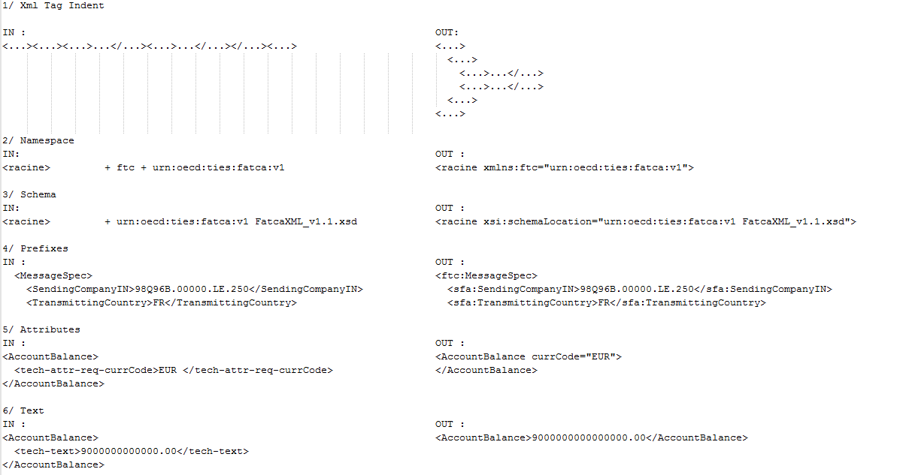
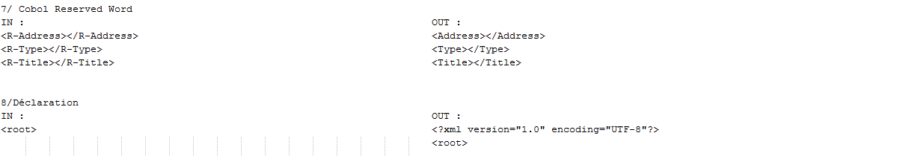

# FATCA-XML-Reporting

FATCA is a new US law aimed to prevent tax evasion by US citizens and US residents through use of offshore accounts.
Foreign financial institutions must identify US accounts, account holders and entities and send XML reports to the IRS.

While most of financial institutions still uses COBOL on mainframe, it lacks advanced XML features support.
So this solution brings features lacking in IBM COBOL ENTREPRISE 4.2.

## FATCA.cbl

Because XML schema to COBOL mapping is not supported by IBM COBOL IBM COBOL ENTREPRISE 4.2,
I use the tool legstar-xsd2cob (see link below) to generate a raw mapping between FATCA Xml schemas and Cobol data description.

Then I enhanced it by adding several informations (data starting with the prefix "tech"). 
those information will be used by the module in order to add features (see below)

https://code.google.com/p/legstar-xsd2cob/

## MFUSXL00.cbl

#### features :

